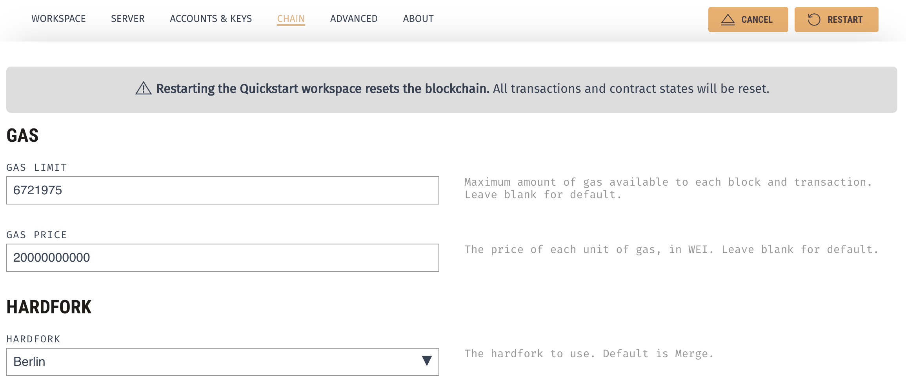
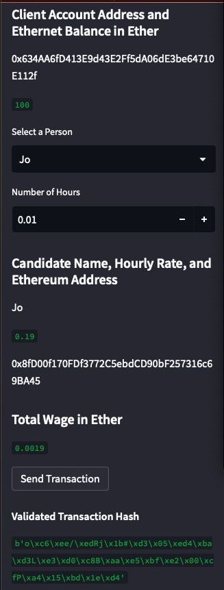
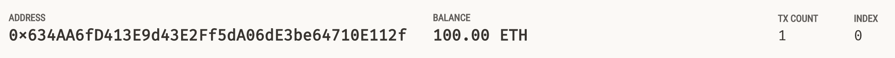
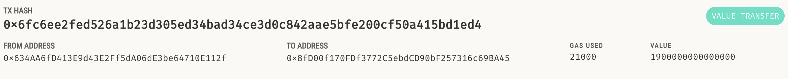

# Challenge assignment 19

Before you run the program, you will have to enter Ganache to get the mnemonic phrase to then put into your .env file where the python programs you downloaded are. In the .env file, create a value similar to this:

MNEMONIC='<the seed phrase listed in Ganache>' 

In order to successfully run the program, you will have to first go into Ganache. Click on the button to the right of the 'Switch' button. Click on the 'Chain' menu option. From there, scroll to the 'HARDFORK' drop-down. Select 'Berlin'. Afterwards, click 'Save and Restart'. Otherwise, you will get a message when executing the fintech_finder.py script complaining about the maxFeePerGas (0) is not at least equal to the baseFeePerGas setting. Please see the screenshot below. 

Proof of the transaction validation is below. 

Per the instructions, proof of the index 0 transaction is below.

Per the instructions, the transaction tab is below.

 
